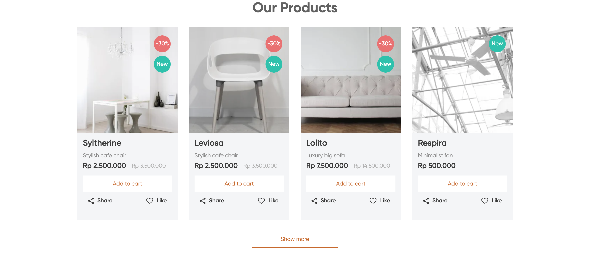

### [Одностраничный сайт Funiro](https://stalise.github.io/Funiro/)

Сайт интернет магазина Funiro реализована в адаптивно-отзывчивой верстке по методологии БЭМ. На сайте реализовна корзина, с возможностью добавления и удаления товаров, подгрузка товаров в формате JSON. Также использользовался иконочный шрифт для элементов интерфейса. При стилизации использовал препроцессор SCSS. Слайдер реализован при помощи библиотеки SwiperJS.

## Полный стэк сайта
- HTML
- SCSS
- JavaScript
- SwiperJS
- Gulp

### [На результат работы можете посмотреть по данной ссылке](https://stalise.github.io/Funiro/)

### Фото-обзор

